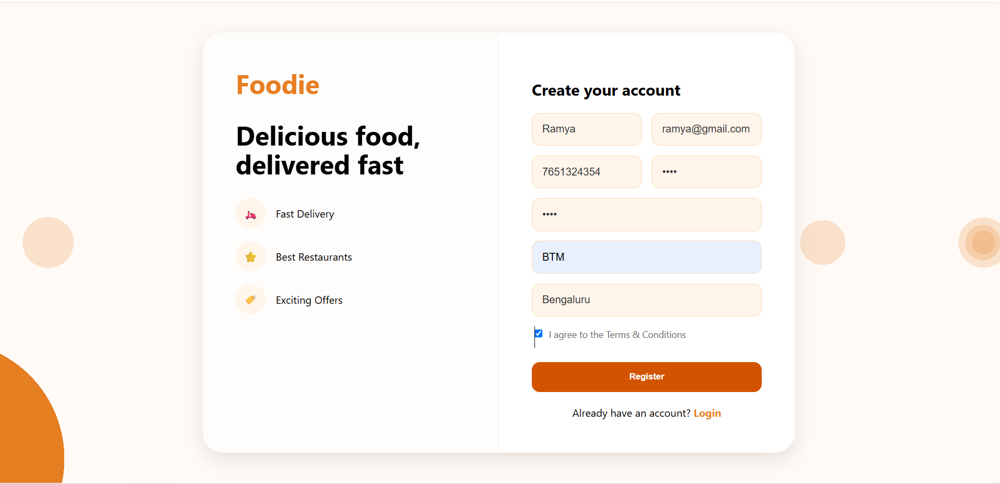

# 🍔 Foodie – Dynamic Java Food Delivery Web Application


# 📌 About The Project

**Foodie** is a Java-based **Full Stack Food Delivery Web Application** designed to provide a seamless and interactive online food ordering experience.

The application enables users to create accounts, securely authenticate, explore restaurants, browse dynamic menus, add food items to their cart, place orders, and manage their order history through a user-friendly interface.

Developed using **Java, JSP, Servlets, JDBC, MySQL, HTML5, CSS3, JavaScript, and Apache Tomcat**, Foodie demonstrates practical implementation of Java Enterprise Web Development concepts including user authentication, session management, CRUD operations, database connectivity, exception handling, and dynamic content rendering using JSP.

The project follows industry-standard development practices using **MVC (Model-View-Controller) Architecture**, **DAO (Data Access Object) Design Pattern**, and **JDBC-based database integration** to achieve a modular, scalable, reusable, and maintainable code structure.

Foodie showcases real-world software development practices by integrating frontend, backend, and database technologies into a complete web application, highlighting skills in **Java Full Stack Development, Object-Oriented Programming, Backend Development, and Database Management**.


## 🎯 Project Objectives

- Build a real-world online food ordering platform.
- Develop a complete Java Full Stack web application.
- Implement MVC architecture and design patterns.
- Practice database-driven application development using JDBC and MySQL.
- Gain hands-on experience in backend development and web application deployment.
- Apply Object-Oriented Programming principles in real-world scenarios.


## 💡 Problem Statement

Traditional food ordering methods often require manual interaction and lack efficient digital management. Foodie addresses this challenge by providing an online platform where customers can easily discover restaurants, explore menus, order food, and manage their orders digitally.

The application simplifies the food ordering process by connecting users with restaurants through an organized, database-driven web solution.

---
# 📑 Table of Contents

- [📌 About The Project](#-about-the-project)
- [✨ Features](#-features)
- [🛠️ Technology Stack](#️-technology-stack)
- [📂 Project Structure](#-project-structure)
- [🗄️ Database Design](#️-database-design)
- [🚀 Key Features](#-key-features)
- [🔄 Application Workflow](#-application-workflow)
- [⚙️ Installation & Setup](#️-installation--setup)
- [▶️ How To Run](#️-how-to-run)
- [📸 Screenshots](#-screenshots)
- [🧪 Testing & Validation](#-testing--validation)
- [🔮 Future Enhancements](#-future-enhancements)
- [👩‍💻 Developer](#-developer)
- [⭐ Conclusion](#-conclusion)
- [📄 License](#-license)
- 
# ✨ Features

- 👤 User Registration & Secure Login
- 🔐 Session-Based Authentication & Authorization
- 🍽️ Browse Restaurants with Dynamic Listings
- 📋 View Restaurant Menus and Food Details
- 🛒 Shopping Cart Management (Add, Update, Remove Items)
- 💳 Seamless Checkout Process
- 📦 Place and Manage Food Orders
- 📜 View Order History
- 👤 User Profile Management
- 🔑 Change Password Functionality
- 🗄️ Complete CRUD Operations using JDBC & MySQL
- ⚡ Dynamic Content Rendering with JSP
- 📱 Responsive and User-Friendly Interface
- ⚠️ Exception Handling & Input Validation
- 🏗️ Clean Layered Architecture for Better Maintainability

---
# 🛠️ Technology Stack

## Frontend

- HTML5
- CSS3
- JavaScript
- JSP (JavaServer Pages)

## Backend

- Java
- Servlets
- JDBC (Java Database Connectivity)

## Database

- MySQL

## Web Server

- Apache Tomcat 10.1

## IDE

- Eclipse IDE

## Version Control

- Git
- GitHub

---
# 📋 Prerequisites

Before running the Foodie application, make sure the following software is installed on your system:

| Requirement | Version |
|------------|---------|
| Java Development Kit (JDK) | 17+ |
| MySQL Database | 8.0+ |
| Apache Tomcat Server | 10.1 |
| Eclipse IDE | Latest Version |
| Git | Latest Version |

## Required Knowledge

- Core Java
- Object-Oriented Programming (OOP)
- JDBC
- JSP & Servlets
- SQL Queries
- MVC Architecture
- DAO Design Pattern

# 🏗️ Software Architecture

The application follows the **Model-View-Controller (MVC)** architecture to ensure separation of concerns and maintain a clean, scalable, and organized codebase.

### Architecture Overview

- **Model:** Represents business entities and application data.
- **View:** JSP pages responsible for rendering the user interface.
- **Controller:** Java Servlets that process client requests, interact with the business layer, and control application flow.
- **DAO Layer:** Handles all database operations using JDBC.
- **Database:** MySQL stores application data securely and efficiently.

```
                 User
                   │
                   ▼
            JSP (View Layer)
                   │
                   ▼
        Servlet (Controller Layer)
                   │
                   ▼
             DAO Interface
                   │
                   ▼
        DAO Implementation Layer
                   │
                   ▼
             MySQL Database
```

---

# 💡 Design Patterns Used

- Model-View-Controller (MVC)
- DAO (Data Access Object)
- Layered Architecture
- Object-Oriented Programming (OOP)
- Separation of Concerns (SoC)

---

# 📂 Project Structure

```text
Foodie
│
├── src
│   └── main
│       ├── java
│       │
│       ├── com.designpattern.controllers
│       │   ├── AddToCartServlet.java
│       │   ├── CartItemServlet.java
│       │   ├── CartServlet.java
│       │   ├── ChangePasswordServlet.java
│       │   ├── CheckoutServlet.java
│       │   ├── HomeServlet.java
│       │   ├── LoginServlet.java
│       │   ├── LogoutServlet.java
│       │   ├── MenuServlet.java
│       │   ├── OrdersServlet.java
│       │   ├── PaymentSuccessServlet.java
│       │   ├── ProfileServlet.java
│       │   ├── RegisterServlet.java
│       │   └── RestaurantServlet.java
│       │
│       ├── com.designpattern.dao
│       │   ├── CartDAO.java
│       │   ├── CartItemDAO.java
│       │   ├── CategoryDAO.java
│       │   ├── EventsDAO.java
│       │   ├── MenuDAO.java
│       │   ├── OrderDAO.java
│       │   ├── OrderItemDAO.java
│       │   ├── RestaurantDAO.java
│       │   └── UserDAO.java
│       │
│       ├── com.designpattern.daoimpl
│       │   ├── CartDAOImpl.java
│       │   ├── CartItemDAOImpl.java
│       │   ├── CategoryDAOImpl.java
│       │   ├── EventsDAOImpl.java
│       │   ├── MenuDAOImpl.java
│       │   ├── OrderDAOImpl.java
│       │   ├── OrderItemDAOImpl.java
│       │   ├── RestaurantDAOImpl.java
│       │   └── UserDAOImpl.java
│       │
│       ├── com.designpattern.model
│       │   ├── Cart.java
│       │   ├── CartItem.java
│       │   ├── Category.java
│       │   ├── Events.java
│       │   ├── Menu.java
│       │   ├── Order.java
│       │   ├── OrderItem.java
│       │   ├── Restaurant.java
│       │   └── User.java
│       │
│       └── com.designpattern.utility
│           └── DBConnection.java
│
├── src
│   └── main
│       └── webapp
│           ├── images
│           ├── css
│           ├── js
│           ├── META-INF
│           ├── WEB-INF
│           │   ├── lib
│           │   └── web.xml
│           │
│           ├── home.jsp
│           ├── login.jsp
│           ├── register.jsp
│           ├── restaurant.jsp
│           ├── menu.jsp
│           ├── cart.jsp
│           ├── checkout.jsp
│           ├── profile.jsp
│           ├── orders.jsp
│           ├── order-success.jsp
│           └── error.jsp
│
├── build
├── screenshots
├── instant_food.sql
├── README.md
└── .gitignore
```
---

# ⚙️ Installation & Setup

Follow the below steps to set up and run the **Foodie - Food Delivery Web Application** on your local machine.

---

## 1️⃣ Clone the Repository

Clone the project using Git:

```bash
git clone https://github.com/n-091/Foodie.git
cd Foodie
```

2️⃣ Import Project into Eclipse IDE
1. Open Eclipse IDE.
2. Select:
    File → Import → Web → WAR File / Existing Projects into Workspace
or
    File → Import → General → Existing Projects into Workspace
3.select the cloned Foodie project folder.
4. Click Finish.

3️⃣ Configure Apache Tomcat Server
1. Install Apache Tomcat 10.1.
2. Add Tomcat Server in Eclipse:
    Window → Preferences → Server → Runtime Environment
3. Select Apache Tomcat 10.1.
4.Configure the Tomcat installation directory.
5. Add the Foodie project to the Tomcat server.

4️⃣ Configure MySQL Database 
1. Install and start MySQL Server.
2.Create the database:
    CREATE DATABASE instant_food;
3. Import the provided SQL file:
   instant_food.sql
4. Open the database connection file:
    src/main/java/com/designpattern/utility/DBConnection.java
5. Update your MySQL credentials:
    private static final String URL = 
    "jdbc:mysql://localhost:3306/instant_food";

  private static final String USERNAME = 
  "your_username";

  private static final String PASSWORD = 
  "your_password";

5️⃣ Add Required Libraries

Make sure the project contains required libraries:
WEB-INF
 └── lib
     ├── mysql-connector-j.jar
     └── required servlet libraries

6️⃣ Run the Application
1. Right-click on the project.
2. Select:
    Run As → Run on Server
3. Select:
    Apache Tomcat 10.1 Server

4.Click Finish.
  Open your browser: http://localhost:8080/Foodie/


# 🗄️ Database Design

Database Name:

```sql
CREATE DATABASE instant_food;
```

### 👤 User Table

Stores customer information and authentication details.

| Column | Description |
|--------|-------------|
| user_id | Primary Key |
| name | User name |
| email | User email |
| password | User password |
| phone | Contact number |
| address | Delivery address |

---

### 🍴 Restaurant Table

Stores restaurant details.

| Column | Description |
|--------|-------------|
| restaurant_id | Primary Key |
| restaurant_name | Name of restaurant |
| location | Restaurant location |
| image | Restaurant image |
| rating | Customer rating |

---

### 🍔 Menu Table

Stores food items available in restaurants.

| Column | Description |
|--------|-------------|
| menu_id | Primary Key |
| restaurant_id | Foreign Key |
| food_name | Food item name |
| description | Food details |
| price | Food price |
| image | Food image |
| category_id | Food category |

---

### 🛒 Cart Table

Stores user shopping cart details.

| Column | Description |
|--------|-------------|
| cart_id | Primary Key |
| user_id | Foreign Key |
| created_date | Cart creation date |

---

### 🧾 Cart Item Table

Stores individual items added to cart.

| Column | Description |
|--------|-------------|
| cart_item_id | Primary Key |
| cart_id | Foreign Key |
| menu_id | Foreign Key |
| quantity | Item quantity |

---

### 📦 Order Table

Stores customer orders.

| Column | Description |
|--------|-------------|
| order_id | Primary Key |
| user_id | Foreign Key |
| order_date | Date of order |
| total_amount | Total order amount |
| status | Order status |

---

### 📋 Order Item Table

Stores ordered food items.

| Column | Description |
|--------|-------------|
| order_item_id | Primary Key |
| order_id | Foreign Key |
| menu_id | Foreign Key |
| quantity | Ordered quantity |
| price | Item price |

---

### 🏷️ Category Table

Stores food categories.

| Column | Description |
|--------|-------------|
| category_id | Primary Key |
| category_name | Category name |
---
## 🔗 Database Relationships

- One **User** can have multiple Orders.
- One **User** can have one active Cart.
- One **Restaurant** can have multiple Menu Items.
- One **Cart** can contain multiple Cart Items.
- One **Menu Item** can belong to one Restaurant.
- One **Order** can contain multiple Order Items.
- One **Category** can contain multiple Menu Items.
# 🚀 Key Features

## 👤 User Features

✅ User Registration  
- New users can create an account.
- User details are securely stored in the database.

✅ User Login & Logout  
- Authentication system using email and password.
- Session management for logged-in users.

✅ Profile Management  
- Users can view and update their profile details.
- Change password functionality available.


## 🍽️ Restaurant Features

✅ Browse Restaurants  
- Users can view available restaurants.
- Restaurant details are dynamically fetched from MySQL database.

✅ View Menu  
- Each restaurant displays its available food items.
- Menu items include food name, image, description, and price.


## 🛒 Cart Features

✅ Add To Cart  
- Users can add multiple food items to their cart.

✅ Update Cart  
- Increase or decrease item quantity.
- Remove unwanted items.

✅ Cart Summary  
- Displays:
  - Item price
  - Quantity
  - Subtotal
  - Total amount


## 📦 Order Features

✅ Checkout System  
- Users can place orders from the cart.

✅ Order Management  
- Stores order details and ordered items in the database.

✅ Order History  
- Users can view their previous orders.

✅ Payment Success Flow  
- Displays successful order confirmation after checkout.


## ⚙️ Technical Features

✅ MVC Architecture  
- Separates application into:
  - Model
  - View
  - Controller

✅ DAO Design Pattern  
- Provides clean database interaction.
- Improves code maintainability.

✅ JDBC Integration  
- Performs database operations using JDBC.

✅ Session Management  
- Maintains user login and cart information.

✅ Dynamic Web Application  
- JSP pages display real-time data from the database.

# 🔄 Application Workflow

The Foodie application follows a simple and efficient user workflow.
```text
            Start
              |
              ↓
      User Opens Website
              |
              ↓
      Register / Login
              |
              ↓
    Browse Restaurants
              |
              ↓
      Select Restaurant
              |
              ↓
        View Menu Items
              |
              ↓
      Add Food To Cart
              |
              ↓
        Manage Cart
              |
              ↓
         Checkout
              |
              ↓
      Confirm Order
              |
              ↓
      Payment Success
              |
              ↓
      View Order History
              |
              ↓
             End
             

---

## 🔹 Backend Request Flow

JSP Pages
    |
    ↓
Servlet Controllers
    |
    ↓
Service Layer
    |
    ↓
DAO Layer
    |
    ↓
JDBC
    |
    ↓
MySQL Database


## 🔹 Request Processing Flow

1. User performs an action from JSP page.
2. Request is sent to the corresponding Servlet.
3. Servlet validates user input.
4. DAO layer communicates with MySQL database.
5. Data is retrieved or updated.
6. Response is returned back to JSP page.

# 📸 Screenshots
## 📂 Screenshots Folder

```text
screenshots/
├── home.jpg
├── login.jpg
├── register.png
├── restaurant.jpg
├── menu.jpg
├── cart.jpg
├── checkout.jpg
├── order-success.jpg
└── er-diagram.png
```
## 🏠 Home Page

The home page displays available restaurants, food categories, and navigation options for users.


## 🔐 Login Page

Users can securely login using their registered email and password.


## 📝 Registration Page

New users can create an account by providing their personal details.




## 🍴 Restaurant Page

Displays the list of available restaurants with restaurant details.


## 🍔 Menu Page

Users can view food items, prices, images, and add items to the cart.


## 🛒 Cart Page

Displays selected food items with quantity management and total calculation.


## 💳 Checkout Page

Users can confirm their order before placing it.


## 📦 Order Success Page

Displays order confirmation after successful checkout.


## 🌐 Live Demo

👉 https://your-demo-link

The application is currently available for local deployment using Apache Tomcat.


# 🧪 Testing & Validation

The Foodie application was tested to ensure all functionalities work correctly and provide a smooth user experience.

## ✅ Functional Testing

| Module | Test Case | Result |
|--------|-----------|--------|
| Registration | Create new user account | ✅ Passed |
| Login | Login with valid credentials | ✅ Passed |
| Login | Login with invalid credentials | ✅ Passed |
| Restaurant | Display restaurant list | ✅ Passed |
| Menu | Display food items dynamically | ✅ Passed |
| Cart | Add items to cart | ✅ Passed |
| Cart | Update item quantity | ✅ Passed |
| Cart | Remove cart items | ✅ Passed |
| Checkout | Place order successfully | ✅ Passed |
| Orders | View order history | ✅ Passed |
| Profile | Update user information | ✅ Passed |


## 🔍 Database Testing

- Verified database connectivity using JDBC.
- Tested CRUD operations:
  - Create new records
  - Read data from database
  - Update existing records
  - Delete records

- Checked relationships between:
  - User & Orders
  - Restaurant & Menu
  - Order & Order Items

## ⚡ Performance Testing
- Tested multiple user requests.
- Verified efficient data retrieval using DAO classes.
- Ensured proper session handling.

## 🛡️ Security Testing
- Validated user inputs.
- Prevented unauthorized access using session management.
- Managed database operations through prepared statements.

# 🔮 Future Enhancements

The Foodie application can be enhanced with additional features to provide a better user experience and improve scalability.

## 🚀 Planned Features

### 📱 Mobile Application
- Develop an Android/iOS application for easier food ordering.
- Provide mobile-friendly user experience.

### 💳 Online Payment Integration
- Integrate secure payment gateways such as:
  - UPI
  - Credit/Debit Cards
  - Net Banking
  - Wallet Payments

### 📍 Live Order Tracking
- Enable real-time order tracking.
- Show delivery partner location and estimated delivery time.

### ⭐ Rating & Review System
- Allow users to rate restaurants and food items.
- Users can share feedback and reviews.

### 🔔 Notifications
- Add email and SMS notifications.
- Notify users about:
  - Order confirmation
  - Order preparation
  - Delivery updates

### 🤖 Personalized Recommendations
- Suggest food items based on:
  - Previous orders
  - User preferences
  - Popular dishes

### 🏪 Restaurant Partner Module
- Allow restaurants to:
  - Manage menus
  - Update food availability
  - Track incoming orders

### 📊 Admin Dashboard
- Add admin panel for:
  - User management
  - Restaurant management
  - Order monitoring
  - Sales reports

# 👩‍💻 Developer

## Nirmala

💻 Java Full Stack Developer Intern @ Tap Academy
🎓 Computer Science Engineering Graduate

Aspiring Software Developer with a strong foundation in Java, Web Development, and Database Management. Passionate about building scalable web applications and improving problem-solving skills through continuous learning.

### Technical Skills

- Java
- JSP & Servlets
- JDBC
- MySQL
- HTML5
- CSS3
- JavaScript
- MVC Architecture
- DAO Design Pattern
- Git & GitHub
- Apache Tomcat

### Professional Interests
- Java Full Stack Development
- Backend Development
- Web Application Development
- Software Engineering

- **GitHub:** [@n-091](https://github.com/n-091)
- **LinkedIn:** [Nirmala](https://www.linkedin.com/in/nirmala091)
- **Email:** nirmalaniruss09@gmail.com

# ⭐ Conclusion
Foodie is a complete **Food Delivery Web Application** developed using **Java, JSP, Servlets, JDBC, and MySQL**.

The project demonstrates real-world software development practices including:

- MVC Architecture
- DAO Design Pattern
- Database Integration
- Session Management
- CRUD Operations
- Object-Oriented Programming principles

The application provides a smooth food ordering experience where users can browse restaurants, explore menus, add items to cart, place orders, and manage their profiles.

This project helped in gaining practical experience in **Java Full Stack Development**, backend implementation, database handling, and building scalable web applications.

---

## 🙏 Thank You

Thank you for visiting this project repository.

⭐ If you find this project useful, consider giving it a star!

- [📄 License](#-license)

This project is developed for learning and demonstration purposes.

You are free to explore the source code, understand the implementation, and use it for educational purposes.

© 2026 Nirmala. All rights reserved.


